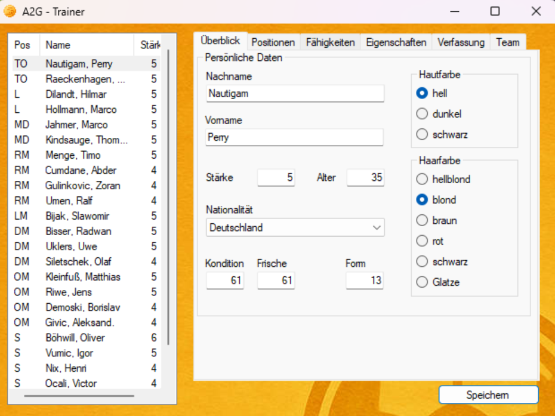

 

# A2G-Trainer

A trainer for **Anstoss 2 Gold**, tested and compatible with both the original CD release and the GOG version.  
Built specifically to run even on legacy systems like **Windows XP SP3 x86**, as well as modern systems like **Windows 11 x64**.

## 📸 Screenshots

## 🛠 Features

- ✅ Live memory editing of *Anstoss 2 Gold*
- ✅ Edit player attributes, positions and skills
- ✅ Supports multiplexed bitfields (skills etc.)
- ✅ Clean WinForms UI with tabbed views
- ✅ Modular MVC architecture
- ✅ Portable version.
- ✅ Runs on **Windows XP** (built against `.NET Framework 4.0`)
- ✅ Uses [Memory.dll](https://github.com/transfairs/memory.dll-xp) for memory access

## 🧩 Dependencies

- On **Windows XP**, make sure [.NET Framework 4.0](https://www.microsoft.com/en-us/download/details.aspx?id=17718) is installed.
- On **Windows 11**, no additional installation is necessary.

## 🚀 Run Instructions

Just launch `A2G-Trainer-XP.exe` while *Anstoss 2 Gold* is running.  
The tool will automatically detect the process and allow in-game editing.

> 📌 [`Memory.dll`](https://github.com/transfairs/memory.dll-xp) must reside in the same folder as the executable.

## 🔧 Build Instructions

1. Open the solution in **Visual Studio 2019**
2. Ensure the target framework is **.NET Framework 4.0**
3. Include [`Memory.dll`](https://github.com/transfairs/memory.dll-xp).
4. Build the project (`Release|x86` recommended for XP) 

## Extras

Included in this repository is an updated **Cheat Engine table** originally created by [strajk-](https://www.anstoss-juenger.de/index.php/topic,4619.0.html) for the original version of *Anstoss 2 Gold* (not the GOG version).

## Credits

Thanks to the [anstoss-juenger.de](https://www.anstoss-juenger.de/index.php/topic,6260.0.html) community, especially **strajk-**. Some code fragments and ideas were taken from his [A2G-RTE project](https://github.com/strajk-/A2G-RTE).

## 🛡 Disclaimer

This tool directly accesses game memory. Use at your own risk.  
This project is **not affiliated** with **Ascaron** or the developers of *Anstoss 2 Gold*.

---

Built with ❤️ for nostalgic Anstoss 2 fanatics.

