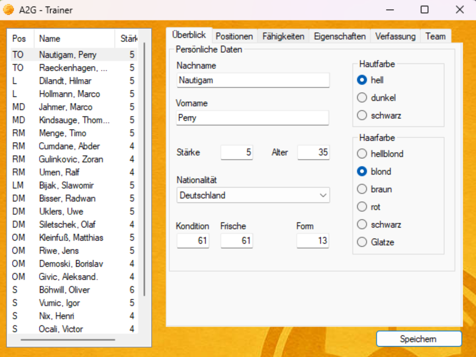
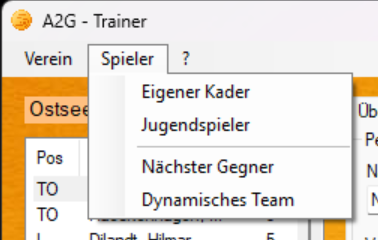
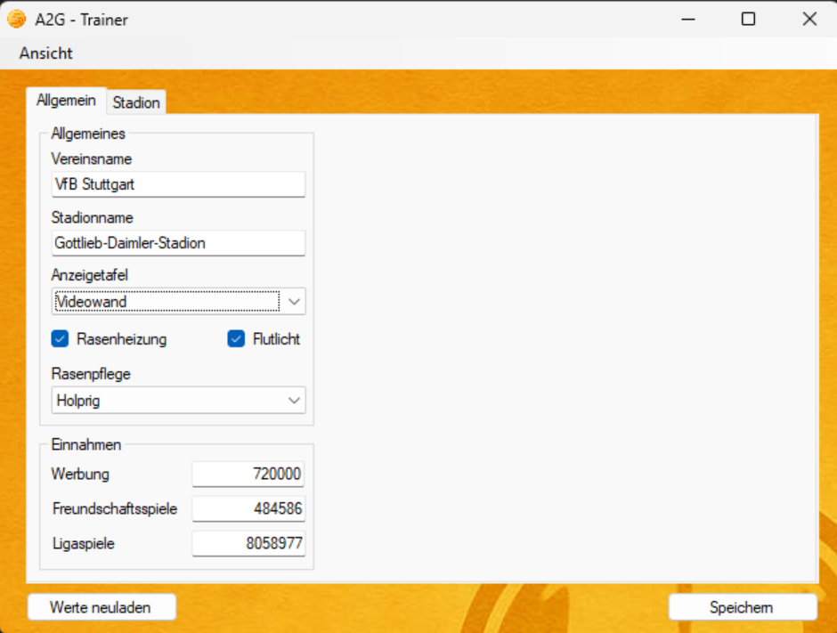
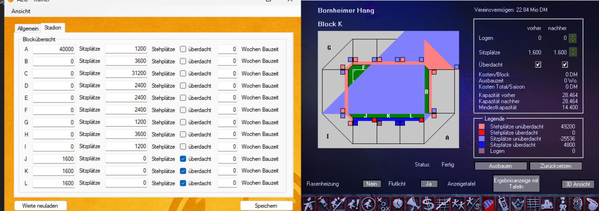
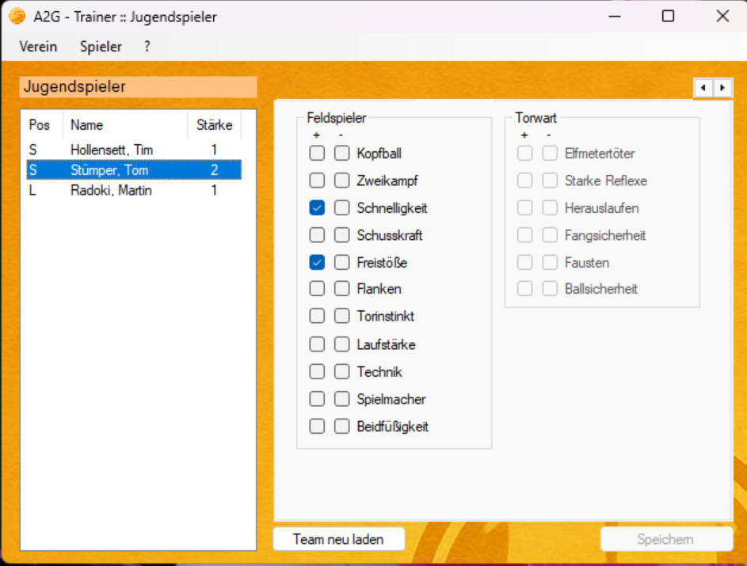
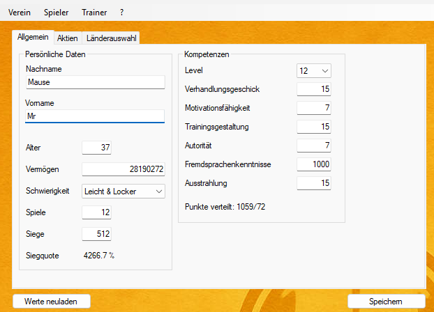

<div align="center">


# A2G-Trainer

A trainer for **Anstoss 2 Gold**, tested and compatible with both the original CD release and the GOG version.
Built specifically to run even on legacy systems. Tested working from **Windows XP SP3 x86** onwards, including all Windows OS versions until **Windows 11 x64**.

  [](https://github.com/transfairs/A2G-Trainer/releases/latest)

[](https://github.com/transfairs/A2G-Trainer/releases/latest/download/A2G-Trainer-XP-Latest.zip)
[](https://transfairs.github.io/A2G-Trainer/)

</div>

## 📸 Screenshots
<div align="center">
<table>
<tr>
<td align="center" width="33%"><br><sub><b>Main view</b> — squad list &amp; player details</sub></td>
<td align="center" width="33%"><br><sub><b>Team choice</b> — own squad, next opponent, dynamic team</sub></td>
<td align="center" width="33%"><br><sub><b>Club view</b> — finances &amp; stadium block overview</sub></td>
</tr>
<tr>
<td align="center" width="33%"><br><sub><b>Stadium editor</b> — seats, roof, construction time</sub></td>
<td align="center" width="33%"><br><sub><b>Youth players</b> — skills editor (Jugendspieler)</sub></td>
<td align="center" width="33%"><br><sub><b>Coach view</b> — competencies &amp; difficulty</sub></td>
</tr>
</table>
</div>

## 🛠 Features
- ✅ Live memory editing of *Anstoss 2 Gold*
- ✅ **Edit all players** and **amateurs** of **any club**
- ✅ Edit player attributes, positions and skills
- ✅ Supports multiplexed bitfields (skills etc.)
- ✅ **Edit your youth players (Jugendspieler)**
- ✅ **Player renames persist permanently** (same length as the old name. See Tips below)
- ✅ Runs on **Windows XP** (built against `.NET Framework 4.0`)
- ✅ **Club editing** (name, finances, stadium details)  
- ✅ **Stadium editor** with up to 2 × 32,767 seats per block  
- ✅ **Freeze condition & freshness** in the Team tab so they stay fixed while you play  
- ✅ **Multi-trainer (hot-seat) support**
- ✅ **Coach editing** (level, age, difficulty, and stocks)
- ✅ **Main country** plus up to 4 additional countries for a career  
- ✅ **Automatic reconnect & turn-handoff detection:** It detects a game restart, a different savegame being loaded, or a hot-seat turn passing
- ✅ **Help section** integrated into the UI, also available as the [online Projektseite](https://transfairs.github.io/A2G-Trainer/)  
- ✅ Clean WinForms UI with tabbed views and menu navigation
- ✅ Modular MVC architecture
- ✅ Portable version

## 🧩 Dependencies

**To run the trainer**
- On **Windows XP**, make sure [.NET Framework 4.0](https://www.microsoft.com/en-us/download/details.aspx?id=17718) is installed.  
- On **Windows 11**, no additional installation is necessary.  

**To build/test from source**
- **Visual Studio 2019+** (Community is fine) with the **.NET desktop development** workload, *or* the standalone [Build Tools for Visual Studio](https://visualstudio.microsoft.com/downloads/#build-tools-for-visual-studio-2022) with the same workload. Either gives you the full MSBuild toolchain this project needs. See the note in **Testing** below on why the plain `dotnet` SDK CLI can't build it end-to-end.
- The [.NET SDK](https://dotnet.microsoft.com/download) (8.0 or newer). Used to run already-built tests and to drive the `dotnet test`/coverage commands below. CI uses 8.0.x.
- No manual **.NET Framework 4.0 Developer/Targeting Pack** install is needed for the main project. `Microsoft.NETFramework.ReferenceAssemblies` supplies those via NuGet automatically on restore.
- The **A2G-Trainer-XP.Tests** project targets **.NET Framework 4.7.2**, which needs that version's Reference Assemblies installed which are included by the "`.NET desktop development`" VS workload above, so no extra step if you have that.

## 🚀 Run Instructions
1. Launch `A2G-Trainer-XP.exe` and start **Anstoss 2 Gold**; either order works.  
2. Load your savegame. The tool detects the game automatically and reconnects on its own after a game restart or when you load a different savegame.  
3. Use the **Tool Strip** to switch to the club view (finances, stadium, etc.) or edit other teams.

## 💡 Tips & Hints
- To assign a **negative number of seats** to a stadium block, enter any value **greater than 32,767**.  
- After editing a stadium block, **Block A is automatically set to one week construction time** to ensure all changes are persisted.  
- A player rename only survives a save/reload if the new name has the **exact same number of characters** as the old one. A different length still shows correctly until the next Tagesabschluss/load, but isn't saved permanently: you'll get a warning naming the player if that happens. Details land in `%LocalAppData%\A2G-Trainer-XP\trainer.log`.  

## 🔧 Build Instructions
1. Open the solution in **Visual Studio 2019**  
2. Ensure the target framework is **.NET Framework 4.0**  
3. Build the project (`Release|x86` recommended for XP). There's also a `Release2007CD|x86` configuration for the original 2007 CD release, which uses GOG-style memory addressing despite not running via `run.exe`.  
4. Optional: run the test suite (see **Testing** below) to verify core logic before building a release  
5. Building from the CLI instead of Visual Studio? See the note under **Testing**. A plain `dotnet build` fails on this project, use `msbuild` as shown there.  

## 🧪 Testing
The **A2G-Trainer-XP.Tests** project (xUnit) covers the memory-reading/writing logic and, for the WinForms views, the actual controls. None of it needs the game running.

**Visual Studio**
- `Test` → `Test Explorer`, then **Run All Tests**.
- Coverage: Enterprise has `Test` → `Analyze Code Coverage for All Tests` built in. On Community/Professional, install the free **Fine Code Coverage** extension, or use the CLI steps below.

**VS Code**
- Install the **C# Dev Kit** extension, then use the **Testing** panel (flask icon) to discover and run tests.
- Coverage: run the CLI steps below, then install **Coverage Gutters** to show results inline in the editor.

**CLI**

Plain `dotnet build`/`dotnet test` **fails outright** on this project (`MSB3822`/`MSB3823`, about `Trainer.resx`'s binary resources needing `System.Resources.Extensions`), because the dotnet SDK's own MSBuild handles this legacy .NET Framework 4.0 project's resources differently than full Visual Studio MSBuild does. Build with `msbuild` first, then run the already-built tests with `dotnet test --no-build` (this is exactly what [`.github/workflows/release.yml`](.github/workflows/release.yml) does in CI):
```bash
msbuild A2G-Trainer-XP.Tests/A2G-Trainer-XP.Tests.csproj /t:Restore,Build /p:Configuration=Debug
dotnet test A2G-Trainer-XP.Tests/A2G-Trainer-XP.Tests.csproj --no-build --no-restore
```
For coverage, add the collector once and pass the same flag to that build:
```bash
dotnet add A2G-Trainer-XP.Tests package coverlet.collector
msbuild A2G-Trainer-XP.Tests/A2G-Trainer-XP.Tests.csproj /t:Restore,Build /p:Configuration=Debug
dotnet test A2G-Trainer-XP.Tests/A2G-Trainer-XP.Tests.csproj --no-build --no-restore --collect:"XPlat Code Coverage"

# turn the raw XML into a browsable report (one-time tool install)
dotnet tool install -g dotnet-reportgenerator-globaltool
reportgenerator -reports:"A2G-Trainer-XP.Tests/TestResults/**/coverage.cobertura.xml" -targetdir:coveragereport -reporttypes:Html
```
Open `coveragereport/index.html` for a per-file/method/line breakdown.

> `msbuild` here means the **full Visual Studio MSBuild**, not the one bundled with the dotnet SDK; make sure the one on your `PATH` resolves there (a "Developer Command Prompt for VS" or a machine with only VS installed gets this right automatically; run `where msbuild` if unsure).

> A handful of tests self-attach to the running test process to exercise real memory reads/writes safely, without a live game - this needs the test host running as **x86** (already set up in the project). The WinForms-view tests additionally spin up real controls on a background STA thread.

Visual Studio's and VS Code's test runners build the project their own way and don't hit this issue. The CLI workaround above is only needed when driving the build from a terminal.

## Extras
Included in this repository is an updated **Cheat Engine table** originally created by [strajk-](https://www.anstoss-juenger.de/index.php/topic,4619.0.html) for the original version of *Anstoss 2 Gold*. Each release also ships a GOG-addressed variant of the same table (`*-GOG.ct`), generated automatically from the original by [scripts/Convert-CtToGog.ps1](scripts/Convert-CtToGog.ps1).

## Credits
Thanks to the [anstoss-juenger.de](https://www.anstoss-juenger.de/index.php/topic,6260.0.html) community, especially **strajk-**. Some code fragments and ideas were taken from his [A2G-RTE project](https://github.com/strajk-/A2G-RTE). Many thanks to **22** for his efforts and assistance in finding any detail of the game in the memory.

## 🛡 Disclaimer
This tool directly accesses game memory. Use at your own risk.  
This project is **not affiliated** with **Ascaron** or the developers of *Anstoss 2 Gold*.
