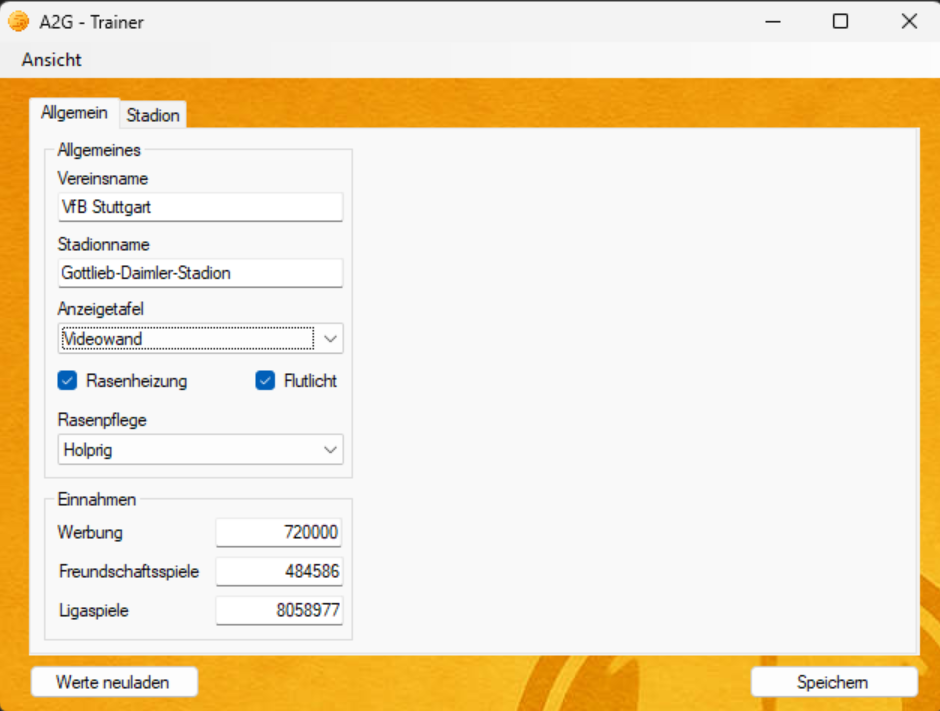
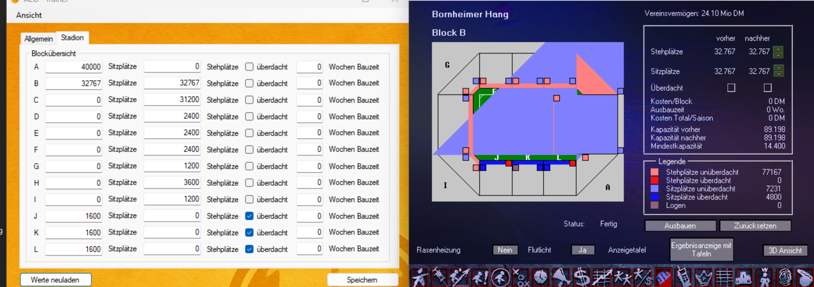

 

# A2G-Trainer

A trainer for **Anstoss 2 Gold**, tested and compatible with both the original CD release and the GOG version.  
Built specifically to run even on legacy systems like **Windows XP SP3 x86**, as well as modern systems like **Windows 11 x64**.

## 📸 Screenshots
  
  

## 🛠 Features
- ✅ Live memory editing of *Anstoss 2 Gold*  
- ✅ Edit player attributes, positions and skills  
- ✅ Supports multiplexed bitfields (skills etc.)  
- ✅ Clean WinForms UI with tabbed views and menu navigation  
- ✅ Modular MVC architecture  
- ✅ Portable version  
- ✅ Runs on **Windows XP** (built against `.NET Framework 4.0`)  
- ✅ Uses [Memory.dll](https://github.com/transfairs/memory.dll-xp) for memory access  
- ✅ **Club editing** (name, finances, stadium details)  
- ✅ **Stadium editor** with up to 2 × 32,767 seats per block  

## 🧩 Dependencies
- On **Windows XP**, make sure [.NET Framework 4.0](https://www.microsoft.com/en-us/download/details.aspx?id=17718) is installed.  
- On **Windows 11**, no additional installation is necessary.  

## 🚀 Run Instructions
1. Start **Anstoss 2 Gold** and **load your savegame**.  
2. Launch `A2G-Trainer-XP.exe`. The tool will automatically detect the process and allow in-game editing.  
3. Click on **Ansicht → Verein** to switch to the club view (finances, stadium, etc.).  

> 📌 [`Memory.dll`](https://github.com/transfairs/memory.dll-xp) must reside in the same folder as the executable.

## 💡 Tips & Hints
- To assign a **negative number of seats** to a stadium block, enter any value **greater than 32,767**.  
- After editing a stadium block, **Block A is automatically set to one week construction time** to ensure all changes are persisted.  

## 🔧 Build Instructions
1. Open the solution in **Visual Studio 2019**  
2. Ensure the target framework is **.NET Framework 4.0**  
3. Include [`Memory.dll`](https://github.com/transfairs/memory.dll-xp).  
4. Build the project (`Release|x86` recommended for XP)  

## Extras
Included in this repository is an updated **Cheat Engine table** originally created by [strajk-](https://www.anstoss-juenger.de/index.php/topic,4619.0.html) for the original version of *Anstoss 2 Gold* (not the GOG version).

## Credits
Thanks to the [anstoss-juenger.de](https://www.anstoss-juenger.de/index.php/topic,6260.0.html) community, especially **strajk-**. Some code fragments and ideas were taken from his [A2G-RTE project](https://github.com/strajk-/A2G-RTE).

## 🛡 Disclaimer
This tool directly accesses game memory. Use at your own risk.  
This project is **not affiliated** with **Ascaron** or the developers of *Anstoss 2 Gold*.

---

Built with ❤️ for nostalgic Anstoss 2 fanatics.
